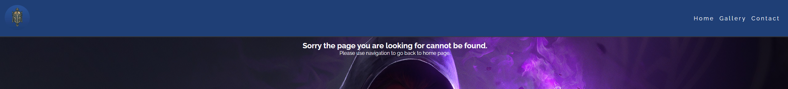
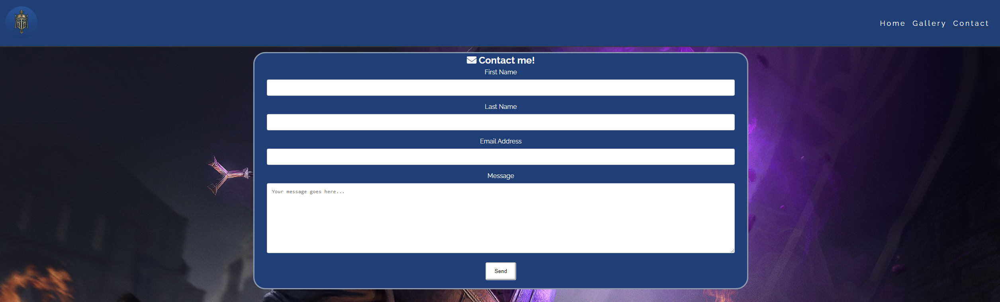
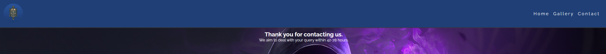
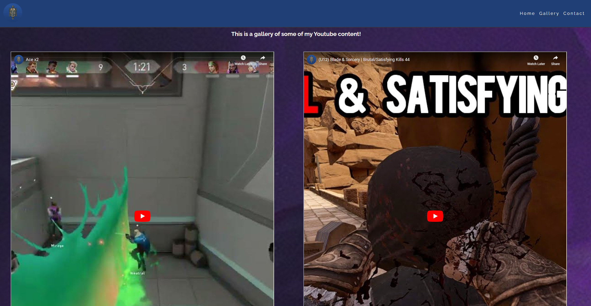

# CrusaderGuy

CrusaderGuy is a website about my youtube channel where I upload gaming videos on PC and Virtual Reality in my free time.
View the live site [here](https://jbcrusader.github.io/miniature-umbrella/)

## Features

### Site wide
* Navigation Menu
    * Contains links to the Home, Gallery and Contact pages and will be responsive on all devices.
    * This will allow users to easily navigate between the pages within the site on any size device. 

* Footer
    * This will contain icons as links to social media websites that will open in new tabs. Icons will be accessible to the visually impaired who may be using a screen reader, by the use of aria labels.
    * This will allow the user to follow 'CrusaderGuy' on various social media where they can get more up to date information that may not be displayed on the website.

* Favicon
    * A site wide favicon will be implemented with youtube profile picture.
    * This will provide an image in the the tabs header to allow the user to easily identify the website if they have multiple tabs open.

* 404 Page
    * A 404 page will be implemented and will display if a user navigates to a broken link.
    * The 404 page will allow the user to easily navigate back to the main website if they direct to a broken link / missing page, without the need  of the browsers back button.

### Landing Page
* Landing page image
    * This will be an image of art from the main game I create content for.
    * This will help to immediately show the user what the website is about. 

* Website information on 'CrusaderGuy'
    * Information about 'CrusaderGuy' and the websites purpose.
    * This information lets the user know what the site is about. 

* Contact form
    * A contact form will be implemented to allow users to contact 'CrusaderGuy'. The form will consist of the following fields and attributes: 
        * First Name (required, type=text)
        * Last Name (required, type=text)
        * Email (required, type=email)
        * Message (required, type=textarea)
    * On successful submission of the contact form, the user will be navigated to thank-you.html displaying a thank you message.
    * This will allow user to contact 'CrusaderGuy' if they have any questions.

### Gallery Page
* Gallery
    * The gallery will provide the user with videos from the 'CrusaderGuy' Youtube channel. The gallery will be fully responsive on all devices and allows the user to filter by categories provided in a sub navigation.
    * This will allow users that are interested in 'CrusaderGuy' to watch some of the videos. As the gallery is responsive it will allow the user to view content from any device. 

### Existing Features

* Responsive design
* Responsive gallery
* Contact form and success page

### Features Left to Implement

* N/A

## Design

## Technologies

* HTML
    * The structure of the Website was developed using HTML as the main language.
* CSS
    * The Website was styled using custom CSS in an external file.
* Visual Studio Code
    * The website was developed using Visual Studio Code IDE
* GitHub
    * Source code is hosted on GitHub and deployed using Git Pages.
* Git 
    * Used to commit and push code during the development opf the Website
* Font Awesome
    * Icons obtained from https://fontawesome.com/ were used as the Social media links in the footer section. 
* Tinyjpg
    * https://tinyjpg.com/ was used to reduce the size of the images used throughout the website
* Favicon.io
    * favicon files were created at https://favicon.io/favicon-converter/ 

## Testing 

### Responsiveness

All pages were tested to ensure responsiveness on screen sizes from 320px and upwards as defined in [WCAG 2.1 Reflow criteria for responsive design](https://www.w3.org/WAI/WCAG21/Understanding/reflow.html) on Chrome, Edge, Firefox and Opera browsers.

Steps to test:

1. Open browser and navigate to [CrusaderGuy](https://jbcrusader.github.io/miniature-umbrella/)
2. Open the developer tools (right click and inspect)
3. Set to responsive and decrease width to 320px
4. Set the zoom to 50%
5. Click and drag the responsive window to maximum width

Expected:

Website is responsive on all screen sizes and no images are pixelated or stretched.
No horizontal scroll is present.
No elements overlap.

Actual:

Website behaved as expected with the exception of switching to landscape view in Mozilla Firefox. Details can be found in [Unfixed Bugs](#Unfixed-Bugs)

Website was also opened on the following devices and no responsive issues were seen:

- Oukitel C21 Pro
- TCL 30 Pro
- iPhone SE
- Samsung Galaxy Tablet