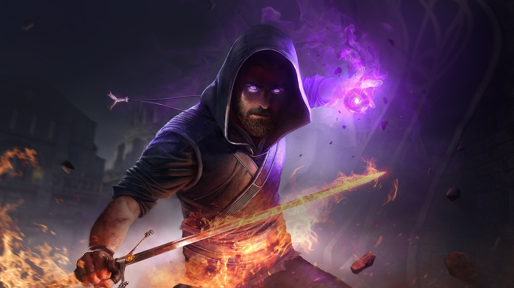
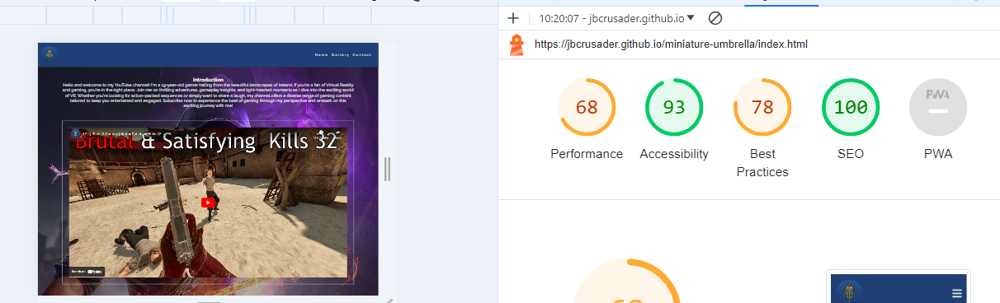
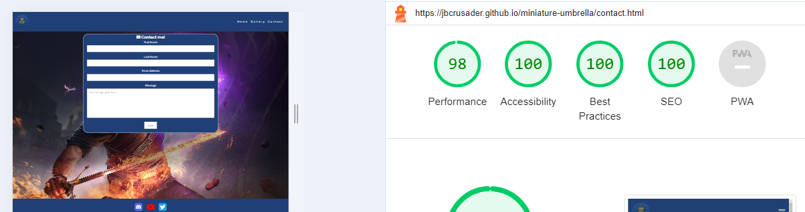
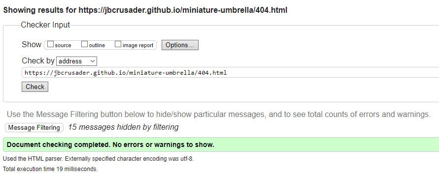

# CrusaderGuy

CrusaderGuy is a website about my youtube channel where I upload gaming videos on PC and Virtual Reality in my free time.
View the live site [here](https://jbcrusader.github.io/miniature-umbrella/)


## Features

### Site wide
* Navigation Menu
    * Contains links to the Home, Gallery and Contact pages and will be responsive on all devices.
    * This will allow users to easily navigate between the pages within the site on any size device. 


* Footer
    * This will contain icons as links to social media websites that will open in new tabs. Icons will be accessible to the visually impaired who may be using a screen reader, by the use of aria labels.
    * This will allow the user to follow 'CrusaderGuy' on various social media where they can get more up to date information that may not be displayed on the website.


* Favicon
    * A site wide favicon will be implemented with youtube profile picture.
    * This will provide an image in the the tabs header to allow the user to easily identify the website if they have multiple tabs open.


* 404 Page
    * A 404 page will be implemented and will display if a user navigates to a broken link.
    * The 404 page will allow the user to easily navigate back to the main website if they direct to a broken link / missing page, without the need  of the browsers back button.


### Landing Page
* Landing page image
    * This will be an image of art from the main game I create content for.
    * This will help to immediately show the user what the website is about. 


* Website information on 'CrusaderGuy'
    * Information about 'CrusaderGuy' and the websites purpose.
    * This information lets the user know what the site is about. 

* Contact form
    * A contact form will be implemented to allow users to contact 'CrusaderGuy'. The form will consist of the following fields and attributes: 
        * First Name (required, type=text)
        * Last Name (required, type=text)
        * Email (required, type=email)
        * Message (required, type=textarea)
    * On successful submission of the contact form, the user will be navigated to thank-you.html displaying a thank you message.
    * This will allow user to contact 'CrusaderGuy' if they have any questions.


### Gallery Page
* Gallery
    * The gallery will provide the user with videos from the 'CrusaderGuy' Youtube channel. The gallery will be fully responsive on all devices and allows the user to filter by categories provided in a sub navigation.
    * This will allow users that are interested in 'CrusaderGuy' to watch some of the videos. As the gallery is responsive it will allow the user to view content from any device. 


### Existing Features

* Responsive design
* Responsive gallery
* Contact form and success page

### Features Left to Implement

* N/A

## Design

## Technologies

* HTML
    * The structure of the Website was developed using HTML as the main language.
* CSS
    * The Website was styled using custom CSS in an external file.
* Visual Studio Code
    * The website was developed using Visual Studio Code IDE
* GitHub
    * Source code is hosted on GitHub and deployed using Git Pages.
* Git 
    * Used to commit and push code during the development opf the Website
* Font Awesome
    * Icons obtained from https://fontawesome.com/ were used as the Social media links in the footer section. 
* Tinyjpg
    * https://tinyjpg.com/ was used to reduce the size of the images used throughout the website
* Favicon.io
    * favicon files were created at https://favicon.io/favicon-converter/ 

## Testing 

### Responsiveness

All pages were tested to ensure responsiveness on screen sizes from 320px and upwards as defined in [WCAG 2.1 Reflow criteria for responsive design](https://www.w3.org/WAI/WCAG21/Understanding/reflow.html) on Chrome, Edge, Firefox and Opera browsers.

Steps to test:

1. Open browser and navigate to [CrusaderGuy](https://jbcrusader.github.io/miniature-umbrella/)
2. Open the developer tools (right click and inspect)
3. Set to responsive and decrease width to 320px
4. Set the zoom to 50%
5. Click and drag the responsive window to maximum width

Expected:

Website is responsive on all screen sizes and no images are pixelated or stretched.
No horizontal scroll is present.
No elements overlap.

Actual:

Website behaved as expected with the exception of switching to landscape view in Mozilla Firefox. Details can be found in [Unfixed Bugs](#Unfixed-Bugs)

Website was also opened on the following devices and no responsive issues were seen:

- Oukitel C21 Pro
- TCL 30 Pro
- iPhone SE
- Samsung Galaxy Tablet

### Accessibility

[Wave Accessibility](https://wave.webaim.org/) tool was used throughout development and for final testing of the deployed website to check for any aid accessibility testing.

Testing was focused to ensure the following criteria were met:

- All forms have associated labels or aria-labels so that this is read out on a screen reader to users who tab to form inputs
- Color contrasts meet a minimum ratio as specified in [WCAG 2.1 Contrast Guidelines](https://www.w3.org/WAI/WCAG21/Understanding/contrast-minimum.html)
- Heading levels are not missed or skipped to ensure the importance of content is relayed correctly to the end user
- All content is contained within landmarks to ensure ease of use for assistive technology, allowing the user to navigate by page regions
- All not textual content had alternative text or titles so descriptions are read out to screen readers
- HTML page lang attribute has been set
- Aria properties have been implemented correctly
- WCAG 2.1 Coding best practices being followed

### Lighthouse Testing






### Functional Testing

**Navigation Links**

Testing was performed to ensure all navigation links on the respective pages, navigated to the correct pages as per design. This was done by clicking on the navigation links on each page.

| Navigation Link | Page to Load    |
| --------------- | --------------- |
| Home            | index.html      |
| Gallery         | gallery.html    |
| Contact         | contact.html    |

Links on all pages navigated to the correct pages as expected.

**Form Testing**

The form on the home page was tested to ensure it functioned as expected when correct data was input and when incorrect data was input. The following test scenarios were covered:

_Scenario One - Correct Inputs_

Steps to test:

1. Navigate to [CrusaderGuy - Home Page](https://jbcrusader.github.io/miniature-umbrella/index.html)
2. Scroll down to the form and input the following data:
   - First Name: John
   - Last Name: Doe
   - Email: doe.john@test.com
   - Comment: This is a test.
3. Click Submit
4. User should be redirected to thank-you.html confirmation page

Expected:

Form submits with no warnings or errors and user is redirected to contact.html confirmation page.

Actual:

Website behaved as expected with no errors or warnings and redirected to contact.html.

_Scenario Two - Missing Required Field First Name_

Steps to test:

1. Navigate to [CrusaderGuy - Home Page](https://jbcrusader.github.io/miniature-umbrella/index.html)
2. Scroll down to the form and input the following data:
   - First Name:
   - Last Name: Doe
   - Email: doe.john@test.com
   - Comment: This is a test.
3. Click Submit

Expected:

The form does not submit and an Error is displayed to tell the user that the field is required.

Actual:

Website behaved as expected, error message was displayed and the form did not submit.

_Scenario Three - Missing Required Field Last Name_

Steps to test:

1. Navigate to [CrusaderGuy - Home Page](https://jbcrusader.github.io/miniature-umbrella/index.html)
2. Scroll down to the form and input the following data:
   - First Name:John
   - Last Name:
   - Email: doe.john@test.com
   - Comment: This is a test.
3. Click Submit

Expected:

The form does not submit and an Error is displayed to tell the user that the field is required.

Actual:

Website behaved as expected, error message was displayed and the form did not submit.

_Scenario Four - Missing Required Field Email_

Steps to test:

1. Navigate to [CrusaderGuy - Home Page](https://jbcrusader.github.io/miniature-umbrella/index.html)
2. Scroll down to the form and input the following data:
   - First Name:John
   - Last Name: Doe
   - Email:
   - Comment: This is a test.
3. Click Submit

Expected:

The form does not submit and an Error is displayed to tell the user that the field is required.

Actual:

Website behaved as expected, error message was displayed and the form did not submit.

_Scenario Six - Incorrect email format_

Steps to test:

1. Navigate to [CrusaderGuy - Home Page](https://jbcrusader.github.io/miniature-umbrella/index.html)
2. Scroll down to the form and input the following data:
   - First Name:John
   - Last Name: Doe
   - Email: doe.johntest.com
   - Comment: This is a test.
3. Click Submit

Expected:

The form does not submit and an Error is displayed to tell the user that a valid email is required and the format it should be in.

Actual:

Website behaved as expected, error message was displayed and the form did not submit.

**Footer Social Media Icons / Links**

Testing was performed on the Font Awesome Social Media icons in the footer to ensure that each one opened in a new tab and that each one had a hover affect of the orange branding color.

Each item opened a new tab when clicked as expected and correct hover color was present.

### Validator Testing 

- HTML
  - No errors were returned when passing through the official [W3C validator](https://validator.w3.org)




- CSS
  - No errors were found when passing through the official [(Jigsaw) validator](https://jigsaw.w3.org)


## Deployment

### Version Control

The site was created using the Visual Studio code editor and pushed to github to the remote repository ‘miniature-umbrella’.

The following git commands were used throughout development to push code to the remote repo:

```git add <file>``` - This command was used to add the file(s) to the staging area before they are committed.

```git commit -m “commit message”``` - This command was used to commit changes to the local repository queue ready for the final step.

```git push``` - This command was used to push all committed code to the remote repository on github.

### Deployment to Github Pages

- The site was deployed to GitHub pages. The steps to deploy are as follows: 
  - In the GitHub repository, navigate to the Settings tab 
  - From the menu on left select 'Pages'
  - From the source section drop-down menu, select the Branch: main
  - Click 'Save'
  - A live link will be displayed in a green banner when published successfully. 

The live link can be found here - https://jbcrusader.github.io/miniature-umbrella/ 

### Clone the Repository Code Locally

Navigate to the GitHub Repository you want to clone to use locally:

- Click on the code drop down button
- Click on HTTPS
- Copy the repository link to the clipboard
- Open your IDE of choice (git must be installed for the next steps)
- Type git clone copied-git-url into the IDE terminal

The project will now of been cloned on your local machine for use.

## Credits 


### Content 


### Media


