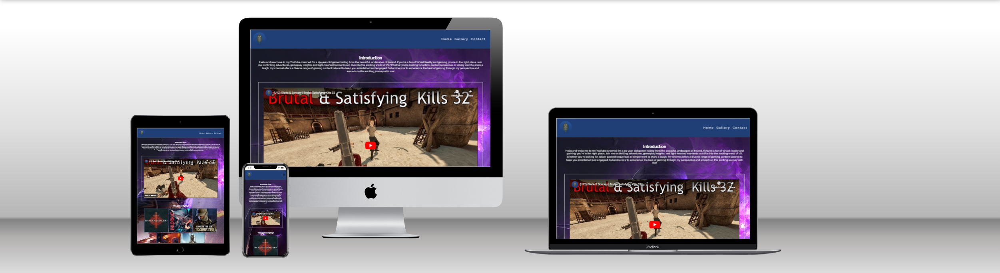

# CrusaderGuy

CrusaderGuy is a website about my youtube channel where I upload gaming videos on PC and Virtual Reality in my free time.
View the live site [here](https://jbcrusader.github.io/miniature-umbrella/)

## Features

### Site wide
* Navigation Menu
    * Contains links to the Home, Gallery and Contact pages and will be responsive on all devices.
    * This will allow users to easily navigate between the pages within the site on any size device. 

* Footer
    * This will contain icons as links to social media websites that will open in new tabs. Icons will be accessible to the visually impaired who may be using a screen reader, by the use of aria labels.
    * This will allow the user to follow 'CrusaderGuy' on various social media where they can get more up to date information that may not be displayed on the website.

* Favicon
    * A site wide favicon will be implemented with youtube profile picture.
    * This will provide an image in the the tabs header to allow the user to easily identify the website if they have multiple tabs open.

* 404 Page
    * A 404 page will be implemented and will display if a user navigates to a broken link.
    * The 404 page will allow the user to easily navigate back to the main website if they direct to a broken link / missing page, without the need  of the browsers back button.

